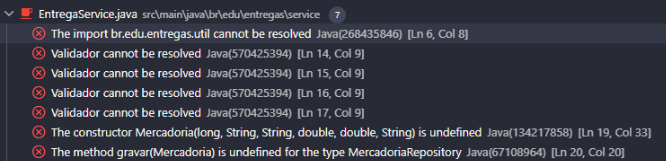
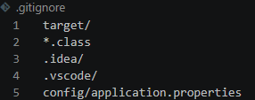

# Relatório de Resgate
- Equipe: Bamboobyte
- Branch de trabalho: resgate/bamboobyte-AugustoLobo e resgate/bamboobyte-HeloisaMedeiros

## Diagnóstico
- O programa não compilava, pois a classe `Validador.java` havia sido removida e o cadastro de mercadorias ficou incompleto.

    **Erros de compilação identificados:**

    

    **Commit que removeu a classe de validação:**

    

    **Diff mostrando a correção da criação de mercadorias:**

    

- Informações sensíveis, como usuário, senha e token, foram adicionadas ao arquivo `application.properties`.

    **Credenciais presentes na configuração:**

    

    **Commit que adicionou as credenciais:**

    

- O `README.md` havia sido simplificado e deixou de explicar como executar o projeto, seus requisitos e os dados de acesso.

    **Conteúdo insuficiente do README:**

    

    **Commit que simplificou o README:**

    

- O repositório também continha configurações locais que deveriam ser ignoradas pelo Git; a correção foi registrada no `.gitignore`.

## Comandos Git utilizados
-git revert: Desfazer um commit. Cria um novo commit que desfaz as alterações de um commit anterior.
-git restore: Restaurar arquivos. Desfaz alterações em arquivos que ainda não foram commitadas.
-git add .gitignore: Adiciona o arquivo .gitignore à área de staging
-git rm: Remove um arquivo do Git e, normalmente, também do computador
-echo: Exibe ou escreve um texto/valor no terminal ou em um arquivo

## Commits relevantes
commit 64f88f6f058bf6279244314b3b444d1c0fef0d23
Author: Igor Reis <igor@entregas.local>
Investigado e recuperado

commit a70ee842c7c426841d0cc618bddcd0bdf0fad654
Author: Henrique Nunes <henrique@entregas.local>
Investigado e revertido

commit 9a6d3b03419d2829036bfee88e87066c79b5bb73
Author: Felipe Rocha <felipe@entregas.local>
Investigado e revertido

commit 7fe8faaaa09c783daf5d44aeb9ff07b85e3a9cc0 (docs-readme)
Author: Carla Souza <carla@entregas.local>
Investigado e recuperado

commit 0cd80f6ca762d65a328cf3b2d4d1d0b06bbbad2e
Author: Gustavo Melo <gustavo@entregas.local>
Investigado e revertido

commit 6572d8ada913855f0dbd9e7a3f15c6824437cf17
Author: Felipe Rocha <felipe@entregas.local>
Investigado e revertido

## Validação final
**Compilação, login e cadastro:**

**Remoção das configurações sensíveis do repositório:**

**Regra adicionada ao `.gitignore`:**

**README restaurado com requisitos, execução e acesso de demonstração:**

